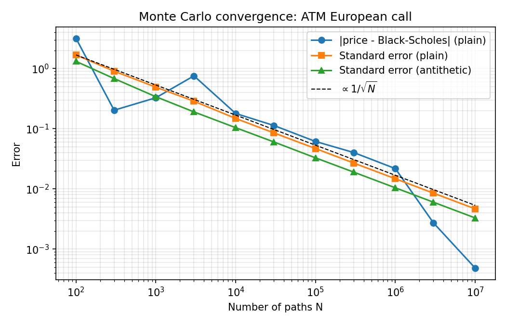

# European Option Pricer (C++17)

A small, readable pricer for European calls and puts under Black-Scholes:

1. **Closed-form Black-Scholes** prices
2. **Monte Carlo** pricer with standard errors, validated against the closed form
3. **Antithetic variates** for variance reduction
4. **Delta and gamma by finite differences**, on both pricers
5. **Unit tests** (GoogleTest, 20 tests)

Every numerical result below comes from the programs in `apps/` and can be reproduced with the commands in [Build and run](#build-and-run).

## Results

Benchmark option: S = 100, K = 100, r = 5%, σ = 20%, T = 1 year.

### Black-Scholes

| | Price |
|---|---|
| Call | 10.4506 |
| Put | 5.5735 |

Put-call parity, C − P = S − K e^(−rT), holds to 7e-15.

### Monte Carlo vs Black-Scholes (1,000,000 paths)

| | Plain MC | Antithetic MC | Black-Scholes |
|---|---|---|---|
| Call | 10.4723 ± 0.0147 | 10.4499 ± 0.0104 | 10.4506 |
| Put | 5.5616 ± 0.0087 | 5.5704 ± 0.0066 | 5.5735 |

Every estimate is within 1.5 standard errors of the exact price.

### Convergence



- The standard error follows the **1/√N** line: 100× more paths buys one more correct digit.
- Antithetic variates cut the variance by a factor of **2.0 for the call** and **1.7 for the put** at equal cost (equal number of payoff evaluations), so plain Monte Carlo would need about twice the paths for the same accuracy. The line is shifted down, not steepened: variance reduction improves the constant, not the rate.
- All runs use the same seed, so larger runs contain the draws of smaller ones and the errors are correlated across rows. The standard error line is the reliable guide; the actual error line is one noisy realisation.

Full table: [results/convergence.csv](results/convergence.csv).

### Greeks by finite differences

Central differences, bumping spot by h in each direction:
delta ≈ [V(S+h) − V(S−h)] / 2h, gamma ≈ [V(S+h) − 2V(S) + V(S−h)] / h².

**On the Black-Scholes price (h = 0.1% of spot):**

| | FD delta | Exact delta | FD gamma | Exact gamma |
|---|---|---|---|---|
| Call | 0.636830 | 0.636831 | 0.018762 | 0.018762 |
| Put | −0.363170 | −0.363169 | 0.018762 | 0.018762 |

**Bump size trade-off (call):**

| Relative bump | Delta error | Gamma error |
|---|---|---|
| 1e-02 | 8.6e-05 | 2.3e-06 |
| 1e-03 | 8.6e-07 | 2.3e-08 |
| 1e-04 | 8.6e-09 | **3.2e-10** |
| 1e-06 | **2.4e-11** | 1.4e-07 |
| 1e-09 | 9.6e-09 | 1.1e+00 |

Large bumps show the O(h²) truncation error of central differences (10× smaller bump, 100× smaller error). Tiny bumps are dominated by floating-point rounding, which is amplified by 1/h for delta and 1/h² for gamma, so gamma breaks down first.

**On the Monte Carlo price (200k antithetic paths, 1% bump, mean ± std over 20 trials):**

| | Delta | Gamma |
|---|---|---|
| Exact | 0.6368 | 0.0188 |
| Same seed for every revaluation | 0.6367 ± 0.0005 | 0.0187 ± 0.0002 |
| New seed for every revaluation | 0.6356 ± 0.0151 | 0.0204 ± 0.0540 |

With independent seeds, the pricing noise (≈ 0.023) is divided by 2h for delta and h² for gamma, which makes gamma noisier than its own value. Reusing the same random numbers (**common random numbers**) makes the noise cancel in the differences and gives a gamma about 230× more precise (standard deviation 0.00024 vs 0.054) at no extra cost.

## Design notes

- **`EuropeanOption`** is a plain struct, so a Greek is just "copy, bump spot, reprice".
- **`norm_cdf`** uses `std::erfc`, so there are no external dependencies and it stays accurate in the left tail.
- **The Monte Carlo pricer samples S_T exactly**: S_T = S·exp((r − σ²/2)T + σ√T·Z). European payoffs need one normal draw per path and no time-stepping, so there is no discretisation error.
- **It returns a price and a standard error** (`McResult`). A Monte Carlo number without an error bar can't be validated.
- **The antithetic standard error is computed over pair means**, because the two halves of a pair are correlated. Treating them as 2N independent samples would give the wrong standard error.
- **`finite_difference_greeks` takes any `PricingFunction`** (`std::function<double(const EuropeanOption&)>`), so the same bump-and-revalue code works for the closed form and for Monte Carlo.
- **Random numbers come from `std::mt19937_64` with an explicit seed**, so results are reproducible. `std::normal_distribution` is implementation-defined, so exact digits can differ between standard libraries, but not statistically.
- **Monte Carlo tests use 4-standard-error tolerances with fixed seeds**: they are deterministic, and a correct implementation would fail about once in 16,000 seeds. As a check, removing the Itô correction (−σ²/2) from the drift makes two tests fail.

## Project layout

```
include/pricer/      public headers
  option.hpp           EuropeanOption, payoff
  black_scholes.hpp    closed-form price, delta, gamma
  monte_carlo.hpp      plain and antithetic Monte Carlo
  greeks.hpp           finite-difference delta and gamma
src/                 implementations (built as the `pricer` library)
apps/
  main.cpp             pricer_demo: prices, MC validation, variance reduction
  convergence.cpp      convergence table + CSV
  greeks.cpp           finite-difference experiments
tests/               GoogleTest unit tests
scripts/             convergence plot (matplotlib)
results/             generated CSV and plot
```

## Build and run

Requirements: a C++17 compiler, CMake ≥ 3.16, and Python 3 for the plot. GoogleTest is downloaded automatically by CMake.

```bash
cmake -S . -B build
cmake --build build
ctest --test-dir build --output-on-failure   # unit tests

./build/pricer_demo                          # prices and variance reduction
./build/convergence results/convergence.csv  # convergence study
./build/greeks                               # finite-difference Greeks

python3 -m venv .venv && .venv/bin/pip install -r requirements.txt
.venv/bin/python scripts/plot_convergence.py results/convergence.csv results/convergence.png
```

**macOS note:** if linking fails with `unknown architecture arm64e.x1`, the Command Line Tools picked an SDK newer than their linker. Point CMake at the matching SDK, for example:
`cmake -S . -B build -DCMAKE_OSX_SYSROOT=/Library/Developer/CommandLineTools/SDKs/MacOSX26.sdk`

## Possible extensions

- Closed-form vega, theta and rho, and finite-difference versions of each
- Pathwise and likelihood-ratio Monte Carlo Greeks (no bumping)
- Control variates (e.g. using the stock price, whose expectation is known)
- Quasi-Monte Carlo (Sobol sequences), which converges faster than 1/√N
- Path-dependent payoffs (Asian, barrier) with time-stepping
- Multithreaded Monte Carlo with independent random streams per thread
